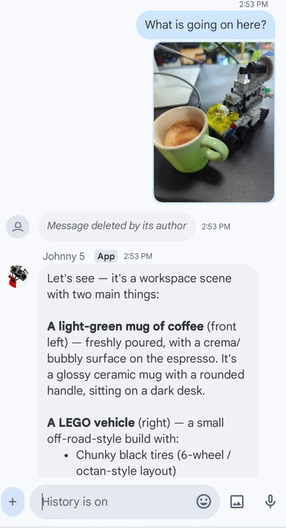

# pi-gchat-bridge

Bridge between **Google Chat** and the **pi coding agent**. Message a Google Chat
bot and it runs pi — with tools, skills, and per-space conversation history.



*pi* is a coding agent that runs on your machine with a session model, tools
and skills — see [pi.dev](https://pi.dev).

**Requires a Google Workspace account.** Custom Chat apps (bots) are only
available to Workspace organizations — personal Gmail accounts can use Chat
itself but can't install third-party Chat apps like this bridge.

## How messages arrive

Chat events are delivered via a **Cloud Pub/Sub pull subscription** — no public
endpoint, no tunnel, works for DMs *and* spaces. The bridge pulls events,
hands them to pi, and replies by posting a placeholder message that is **edited
in place** as pi streams, so you watch the answer appear live.

## One-time setup (Google Cloud Console)

1. **Create a project** at <https://console.cloud.google.com/projectcreate> (or reuse one).
2. **Enable the Google Chat API** (<https://console.cloud.google.com/apis/api/chat.googleapis.com>).
3. **Configure the Chat app** (<https://console.cloud.google.com/apis/api/chat.googleapis.com> → *Configuration*):
   - App name, avatar, description (e.g. "pi bridge")
   - **Do NOT** check "Build this Chat app as a Workspace add-on" (irreversible)
   - Connection settings → **Cloud Pub/Sub** → topic `projects/<project>/topics/chat-events`
   - Authentication Audience → **Project number**
   - Publishing: **"Specific people or group"** (add `your-email@example.com`) or *"Everyone in your organization"* — internal, no Google review
   - **Service account**: select the one created in step 4
4. **Create a service account** (IAM & Admin → Service Accounts → *Create service account*) and **download its JSON key** (Keys → Add key → JSON).
5. **Create the Pub/Sub topic + pull subscription** (Pub/Sub → Topics → *Create topic*):
   - Topic `chat-events`, subscription `chat-events-sub` (delivery type **Pull**)
   - Topic IAM: `chat-api-push@system.gserviceaccount.com` → **Pub/Sub Publisher** (required!)
   - Subscription IAM: `chat-bot@<project>.iam.gserviceaccount.com` → **Pub/Sub Subscriber**
6. In **Google Chat**, add the app to a space (or DM it) to install it.

## Local setup

**Prerequisites:** pi installed with provider API keys configured in
`~/.pi/agent`, and Node.js ≥ 22.19.

```bash
cd pi-gchat-bridge
npm install
cp .env.example .env
# edit .env: point GOOGLE_SERVICE_ACCOUNT_JSON at your key file
npm start
```

That's it — the bot now answers messages in any space it's installed in.

## How it behaves

- **Live streaming replies** — after a short delay a "Thinking…" placeholder
  is posted and **patched in place** as pi generates the answer, so you watch
  the reply appear live.
- **One pi session per thread** — conversations persist across bridge
  restarts (JSONL files under `sessions/`, keyed by thread; non-threaded DMs
  key by space). Threads are fully independent conversations. See
  [Session model & persistence](#session-model--persistence) for how sessions
  are named, adopted, and kept across restarts.
- **Interleaved messages (steer)** — sending a message while pi is working
  queues it into the *running* turn: it's delivered after the current tool
  call finishes (tool results land first) and before the next LLM call, so
  pi keeps its tool loop active and addresses your new message alongside the
  original work — "tool call start, message, tool call response". Commands
  (`/help`, `/model`, `/resume`) instead interrupt the running reply.
- **pi extensions & skills work** — the session loads your `~/.pi/agent`
  extensions, so `/commands` and skills behave like in the TUI.
- **Images & text** — pasted (or uploaded) images are downloaded and passed to
  pi as multimodal input, so a vision model can describe what you send. Images
  can arrive with text or on their own (an image-only message is a valid
  prompt); non-image attachments are skipped with a notice.

  > Actually describing an image needs a **multimodal model** — a text-only
  > model won't see it (pi omits the image and the reply ignores it). The bot
  > still **can't send** images — that's a platform limit, see
  > [Known limitations](#known-limitations).

## Session model & persistence

- **`/resume`, `/sessions`, `/list`** — manually adopt *any* session file
  (bridge store or pi's global store) into the current thread. The binding
  (conversation → session file) is **persisted in `state.json`**, so it
  survives bridge restarts. Resuming a conversation's own derived file
  reverts it to the default. The adopted session must still exist on disk —
  the binding stores a path, not a copy. After resuming, continuing the
  source session elsewhere (e.g. in the TUI) forks the conversation — those
  messages never appear in Chat.

### Model switching and the default

- **`/model` in a conversation** switches **only that conversation** to the
  chosen model. The choice is written into the session file (`model_change`
  entry), so it survives bridge restarts and other conversations are
  unaffected. It does **not** change the global default.
- **`/model` in a brand-new conversation** (no session yet) offers to change
  the **default model** instead — shown with a note that it only affects
  *new* conversations and that existing ones must be switched individually
  with `/model` in each conversation.
- API access needs an API key scoped to the provider's models, or the model
  will appear in the picker but fail to be selected.

## Configuration

| Env var | Default | Meaning |
|---|---|---|
| `GOOGLE_SERVICE_ACCOUNT_JSON` | — (required) | Path to service account key |
| `PUBSUB_SUBSCRIPTION` | — (required) | `projects/.../subscriptions/...` |
| `PI_CWD` | bridge dir | Working dir for pi tools |
| `BRIDGE_SESSIONS_DIR` | `./sessions` | Per-space pi session files |
| `BRIDGE_STATE_FILE` | `./state.json` | Message dedupe state |
| `PORT` | `8080` | Health endpoint (0 disables) |
| `BRIDGE_STALL_TIMEOUT_MS` | `1200000` (20 min) | Watchdog: force-reset a session streaming with no agent activity for this long (0 disables) |
| `BRIDGE_WATCHDOG_INTERVAL_MS` | `30000` | Watchdog scan interval |

### Stuck-session watchdog

If a session's tool call hangs (e.g. the agent runs a network fetch without a
timeout), the session streams forever and every message in that conversation is
deferred as "busy" — exactly what happened with the 22:43 `PY3n26MpvnI` hang.
The watchdog checks each streaming session for agent activity (any emitted
event) and, after `BRIDGE_STALL_TIMEOUT_MS` of silence, aborts the stuck run,
drops the incomplete trailing turn from the session file (so the hung tool call
is never re-run), and reopens the session. Deferred "busy" messages are then
redelivered by Pub/Sub to the fresh session.

## Roadmap

- [x] Pub/Sub receiver (DMs + spaces, no public endpoint)
- [x] Streaming replies (live in-place editing)
- [ ] Allowed-users filter (whitelist who can message the bot)
- [x] Parallel processing: per-thread sessions + concurrent dispatch (threads are independent; serial within a thread)

## Security notes

- The service account has **`chat.bot` scope only** — it can read messages in
  spaces it's in and post as the bot. It cannot touch your Drive/Mail/Calendar.
- pi sessions in the bridge get the **full default toolset** (`read`, `bash`,
  `edit`, `write`) against `PI_CWD`. Anyone who can message the bot can run
  commands — keep the app limited to your org / specific people.

## Known limitations

These are platform-level constraints (verified Aug 2026) — the bridge can't
work around them without external pieces:

- **Only one bridge may run at a time.** With multiple instances pulling the
  same Pub/Sub subscription, each message is delivered only to the instance
  that pulls it first, so replies get split across instances (each message
  goes to just one) rather than duplicated.

- **Personal Gmail accounts can't use the bridge.** Custom Chat apps (bots)
  are only available to Google Workspace organizations — a personal Gmail
  account can chat with a bot but can't install or develop one, so the bridge
  needs a Workspace account.

- **Markdown tables don't render.** Since Aug 2026 the bridge sends replies
  with `markupSyntax: MARKUP_SYNTAX_MARKDOWN`, so standard Markdown (bold,
  italic, strikethrough, monospace, code fences, bulleted/nested/numbered
  lists, block quotes, links) renders properly in Chat. GFM pipe tables are
  *not* in the supported Markdown subset and still show up as literal text —
  the closest rendering is an aligned monospace fenced block, and cards have
  no table widget either. Tracked upstream:
  [issue 428659965](https://issuetracker.google.com/issues/428659965).

- **Streamed placeholders can't render Markdown.** `markupSyntax` is
  create-only — a text PATCH resets a message to legacy Chat syntax and the
  field isn't a valid `updateMask` path (verified Aug 2026). The live
  "Thinking…" placeholder is therefore deleted and replaced by a fresh
  Markdown message when the reply is done, leaving a "Message deleted" stub
  in the thread.

- **Threaded conversations get several notifications per reply.** In a
  thread you'll get a ping for the "Thinking…" placeholder, another for the
  relocated placeholder after a steering message, and one for the final
  answer — and these can appear even when the Chat window has focus. The
  bridge creates the placeholder silent where it can, but Google's API
  rejects `silent` for threaded messages (403 when combined with
  `messageReplyOption`, verified Aug 2026) and message thread placement
  isn't patchable, so a silent message inside an existing thread isn't
  possible. Top-level (non-threaded) conversations get exactly one
  notification — the final answer.

- **Bots can't upload media attachments.** The `attachments:upload`
  (`media.upload`) endpoint rejects service-account auth outright
  ("This method doesn't support app authentication with a service account")
  — even with `chat.messages` claimed on the service-account token. It
  requires **user delegation**: user OAuth (`chat.messages` scope, one-time
  consent) or Workspace **domain-wide delegation** (service account
  impersonating a user). Either way the attachment message is attributed to
  the delegated user, not the bot, so inline images from pi aren't possible
  with the current `chat.bot`-only setup. Tracked upstream:
  [issue 447642391](https://issuetracker.google.com/issues/447642391).

- **No typing/thinking indicators.** The Chat API currently has no support
  for typing or thinking indicators for bots — the bridge fakes liveness with
  the delayed "Thinking…" placeholder instead. Tracked upstream:
  [issue 166140696](https://issuetracker.google.com/issues/166140696).

## Disclaimer

This is a personal project. The views, code, and opinions expressed here are
my own and do not represent those of my current or past employers.
